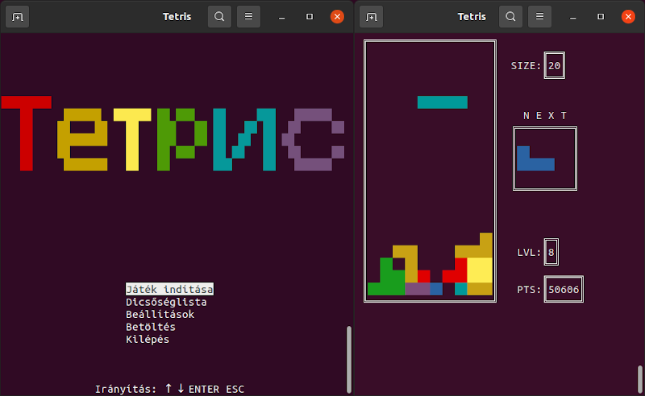

# CLI Tetris

This repo consists of a classic Tetris game, which I made as a homework
for a programming subject in the 1st semester
(InfoPy, BME EET - Programozás alapjai).

To play the game, clone the repo and run `main.py` with python3.

## Acknowledgements

It uses the [colorama](https://github.com/tartley/colorama/)
(by Jonathan Hartley) and
[pyconio](https://infopy.eet.bme.hu/pyconio/pyconio.zip) (by Zoltan Czirkos)
external modules, which are licensed under BSD-3-Clause and MIT respectively.
The rest of the code is licensed under GPL3.
More details about the modules can be found in their respective folders.

The program's English documentation
is included in the source code as docstrings,
additional documentation (in Hungarian)
can be found in the .md and .pdf files in the root directory.

## Supported environments

The game was tested on Linux, Windows, MacOS and Android too, and it should
work on any environment that supports ANSI (or Windows) terminal
escape sequences and can run Python 3 programs.
I haven't tried to run the game with different python3 versions, only 3.8.

## Appearance

